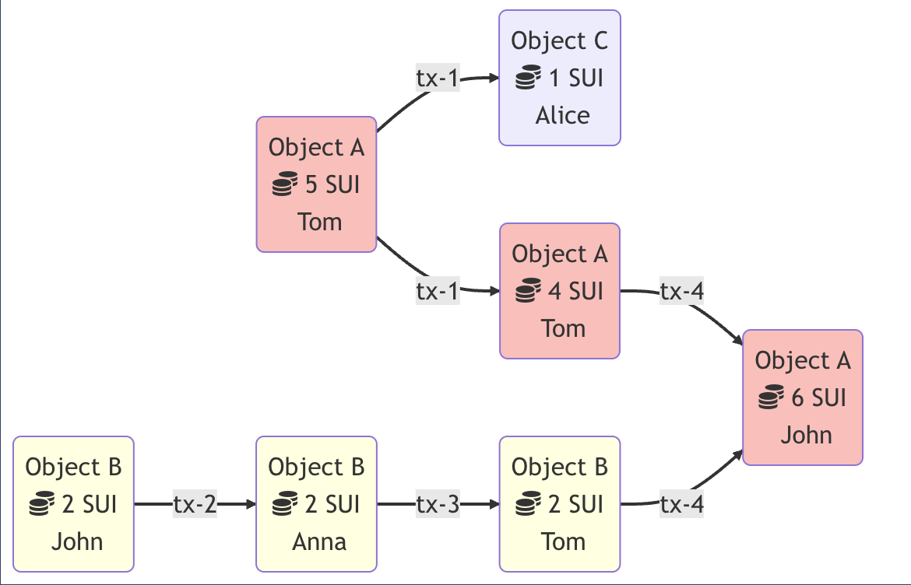

# How Sui Works
Sui uses objects as its basic unit of data storage rather than accounts, as happens on most other blockchains. Developers define, create, and manage these programmable objects that represent user-level assets. An object has distinct attributes, including ownership, whose values can be updated based on the governing logic of the smart contract that created it.

Although a smart contract creates an object, it does not store the object. Objects and their attributes are stored directly on-chain.

All updates to the Sui ledger happen via a transaction.Move call transaction is a smart contract call that invokes a function in a published Move package with objects owned by the sender and pure values (e.g., integers) as inputs. Executing a function may read, write, mutate, and transfer these input objects, as well as other objects created during execution.
## Object

Each Sui object has the following metadata:

* A 32 byte globally unique ID. An object ID is derived from the digest of the transaction that created the object and from a counter encoding the number of IDs generated by the transaction.
* An 8 byte unsigned integer version which monotonically increases with every transaction that reads or writes it.
* A 32 byte transaction digest indicating the last transaction that included this object as an output.
* A 21 byte owner field that indicates how this object can be accessed. Object ownership will be explained in detail in the next section.

In addition to common metadata, objects have a category-specific, variable-sized contents field. For a data value, this contains the Move type of the object and its [Binary Canonical Serialization (BCS)](https://docs.rs/bcs/latest/bcs/)-encoded payload. For a package value, this contains the bytecode modules in the package.

## Transaction

All Sui transactions have the following common metadata:

* Sender address: The address of the user sending this transaction.
* Gas input: An object reference pointing to the object that will be used to pay for this transaction's execution and storage. This object must be owned by the user and must be of type `sui::coin::Coin<SUI>` (i.e., the Sui native currency).
* Gas price: An unsigned integer specifying the number of native tokens per gas unit this transaction will pay. The gas price must always be nonzero.
* Maximum gas budget: The maximum number of gas units that can be expended by executing this transaction. If this budget is exceeded, transaction execution will abort and have no effects other than debiting the gas input. The gas input object must have a value higher than the gas price multiplied by the max gas, and this product is the maximum amount that the gas input object will be debited for the transaction.
* Epoch: The Sui epoch this transaction is intended for.
* Type: A call, publish, or native transaction and its type-specific-data (see below).
* Authenticator: A cryptographic signature on the Binary Canonical Serialization (BCS)-encoded bytes of the data above, and a public key that both verifies against the signature and is cryptographically committed to by the sender address.
* Expiration: An epoch reference that sets a deadline after which validators will no longer consider the transaction valid. The optional expiration epoch reference enables users to define transactions that either execute and commit by a set time (current epoch less than or equal to expiration epoch), or never execute after the deadline passes. By default, there is no deadline for when a transaction must execute.

In addition to the common metadata above, a Move call transaction includes the following fields:

* Package: An object reference pointing to a previously published Move package object.
* Module: A UTF-8 string specifying the name of a Move module in the package.
* Function: A UTF-8 string specifying the name of a function inside the module. The function must be a valid entry point.
* Type Inputs: A list of Move types that will be bound to the type parameters of the function.
* Object Inputs: A list of unique object references pointing to objects that will be passed to this function. Each object must either be owned by the sender, immutable or shared. The gas input object from above cannot also appear as an object input.
* Pure Inputs: A list of BCS-encoded values that will be bound to the parameters of the function. Pure inputs must be primitive types (i.e. addresses, object IDs, strings, bytes, integers, or booleans)--they cannot be objects.

A Move call transaction sended by a user with "package-module-function-arguments". then Sui's runtime use this to execulate codes of the function with arguments.
modify storage if needed. and Sui's state changed.

## Mempool and Consensus Engines

 [Narwhal](https://github.com/MystenLabs/sui/tree/main/narwhal), and [Bullshark](https://arxiv.org/abs/2209.05633), the high-throughput mempool and consensus engines offered by Mysten Labs. Sui uses Narwhal as the mempool and Bullshark as the consensus engine by default, to sequence transactions that require a total ordering, synchronize transactions between validators and periodically checkpoint the network's state.

 The names highlight that the components split the responsibilities of:

* ensuring the availability of data submitted to consensus = Narwhal
* agreeing on a specific ordering of this data = Bullshark

The Narwhal mempool offers:

* a high-throughput data availability engine, with cryptographic proofs of data availability at a primary node
* a structured graph data structure for traversing this information
* a scaled architecture, splitting the disk I/O and networking requirements across several workers

A Narwhal instance sets up a message-passing system comprised of a set of 
 units of stake divided amongst a set of nodes, and assumes a computationally bounded adversary that controls the network and can corrupt parties holding up to f units of stake. The validators collaborate in forming a leaderless graph of batches of transactions - which the literature (in the context of DAG-based consensus) designates as blocks and that Sui labels collections - to emphasize that this happens in a context where the mempool data is used by an unspecified consensus algorithm.

The graph's vertices consist of certified collections. Each valid collection signed by its validator-author must contain a round number and must itself be signed by a quorum (2f+1) of validator stake. These 2f+1 signatures are called a certificate of availability. Furthermore, that collection must contain hash pointers to a quorum of valid certificates (that is, certificates from validators with 2f + 1 units of stake) from the previous round (see Danezis & al. Fig 2), which constitute the edges of the graph.

Each collection is formed in the following way: each validator reliably broadcasts a collection for each round. Subject to specified validity conditions, if validators with 2f + 1 stake receive a collection, they acknowledge it with a signature each. Signatures from 2f + 1 validators by stake form a certificate of availability that is then shared and potentially included in collections at round r + 1.

The following figure represents five rounds of construction of such a DAG (1 to 5), with authorities A, B, C and D participating. For simplicity, each validator holds 1 unit of stake. The collections transitively acknowledged by A's latest round in A5 are represented in full lines in the graph.

## Sui Coin Example
Here's an example showing how objects and transactions are connected to each other in Sui.

In the following example there are two objects:

* Object A with 5 SUI coins that belongs to Tom
* Object B with 2 SUI coins that belongs to John

Tom decides to send 1 SUI coin to Alice. In this case, Object A is the input to this transaction and 1 SUI coin is debited from this object. The output of the transaction is two objects:

* Object A with 4 SUI coins that still belongs to Tom
* new created Object C with 1 SUI coin that belongs now to Alice

At the same time, John decides to send 2 SUI coins to Anna. Because the relationship between objects and transactions is written in a directed acyclic graph (DAG), and both transactions interact with different objects, this transaction executes in parallel with the transaction that sends coins from Tom to Alice. This transaction changes only the owner of Object B from John to Anna.

After receiving 2 SUI coins, Anna sent them immediately to Tom. Now Tom has 6 SUI coins (4 from Object A and 2 from Object B).

Finally, Tom sends all of his SUI coins to John. For this transaction, the input is actually two objects (Object A and Object B). Object B is destroyed, and its value is added to Object A. As a result, the transaction's output is only Object A with a value of 6 SUI.

